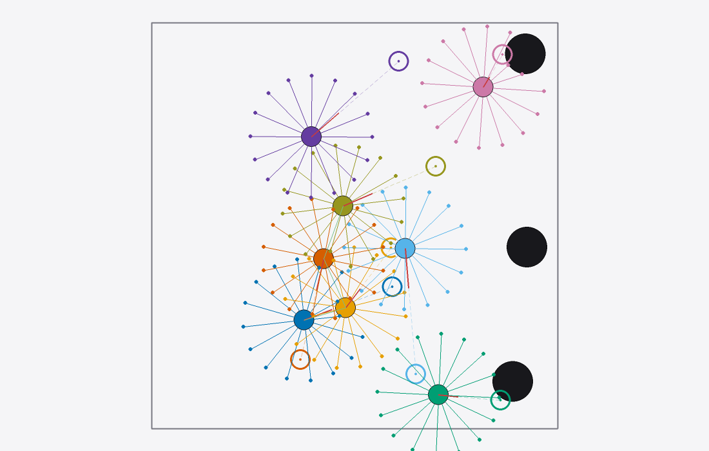

<p align="center">
  <picture>
    <source media="(prefers-color-scheme: dark)" srcset="img/swarp_dark.svg">
    
  </picture>
</p>

<h1 align="center">swarp</h1>

<p align="center">
  <b>Swarm simulation on NVIDIA Warp</b><br>
  A GPU-resident, differentiable, vectorized simulator for 2D multi-robot tasks.
</p>

<p align="center">
  <a href="https://github.com/ddebenedittis/swarp/actions/workflows/ci.yml"></a>
  <a href="https://ddebenedittis.github.io/swarp/"></a>
  
  <a href="LICENSE"></a>
</p>

<p align="center">
  
</p>

## What is swarp?

swarp keeps every environment in the batch on-device as `[n_envs, n_agents]` Warp arrays and advances all of them with compiled kernels, so the hot loop performs no host↔device transfers.
Conceptually it is [VMAS](https://github.com/proroklab/VectorizedMultiAgentSimulator), with the step compiled as [NVIDIA Warp](https://github.com/NVIDIA/warp) kernels instead of per-entity PyTorch ops.

The whole step — dynamics, soft collisions, walls — also runs under Warp's adjoint tape and is exposed to PyTorch autograd, so you can backprop through the physics as easily as you can roll it out.

**📖 Documentation: [ddebenedittis.github.io/swarp](https://ddebenedittis.github.io/swarp/)**

## Highlights

- **Batched and on-device** — one `step` advances thousands of envs; observations, rewards, masked resets and the radius graph never leave the GPU. [→](https://ddebenedittis.github.io/swarp/environment.html)
- **Differentiable end-to-end** — BPTT through multi-step rollouts, verified with strict `torch.autograd.gradcheck` in float64. [→](https://ddebenedittis.github.io/swarp/differentiability.html)
- **Four dynamics models** — holonomic point, differential drive, kinematic bicycle and a 6-DOF quadrotor, mixable per agent in one world. [→](https://ddebenedittis.github.io/swarp/dynamics.html)
- **Soft contacts and rigid bodies** — spring-damper interactions against agents, circle/box/segment obstacles and walls, plus movable compound rigid bodies pushed by the reaction of those same contacts. [→](https://ddebenedittis.github.io/swarp/world.html)
- **Neighbor search without a sync** — padded within-radius lists, an explicit overflow flag, a COO radius graph for GNN policies, and three interchangeable backends tested to agree exactly. [→](https://ddebenedittis.github.io/swarp/world.html#neighbor-search)
- **Seven scenarios** — navigation, flocking, formation, discovery, sampling, transport and Push-T, each with fused Warp obs/reward kernels alongside the torch reference they are parity-tested against. [→](https://ddebenedittis.github.io/swarp/scenarios.html)
- **Fast by default** — **24.1 M env-steps/s** at 16,000 envs × 16 agents on one RTX 3070 Laptop GPU from the fused Warp obs/reward kernels alone, with whole-step CUDA-graph capture (on by default) taking 16,384 × 16 to 35.6 M. [→](https://ddebenedittis.github.io/swarp/performance.html)
- **Interactive viewer** — an optional pygame renderer with headless frames, mp4/webm export, notebook embedding, a batch mosaic and live overlay toggles. [→](https://ddebenedittis.github.io/swarp/visualization.html)

## Install

Requires Python ≥ 3.12. A CUDA GPU is optional — everything also runs on CPU.

```bash
git clone https://github.com/ddebenedittis/swarp.git && cd swarp
uv venv
uv pip install -e . --group dev
uv run pytest -m "not gpu"
```

Optional extras:

```bash
uv pip install -e '.[viz]'       # interactive viewer + video export
uv pip install -e '.[torchrl]'   # TorchRL EnvBase wrapper
uv pip install -e '.[bench]'     # VMAS, for the comparison benchmark
```

Full instructions, including the plain-pip route and the CPU-only torch wheel, are in the [installation guide](https://ddebenedittis.github.io/swarp/installation.html).

## Quickstart

```python
import torch
import swarp

env = swarp.make("navigation", n_envs=4096, n_agents=8, device="cuda:0", dt=0.05)

obs = env.reset()                                  # [n_envs, n_agents, obs_dim], on the GPU
for _ in range(100):
    actions = torch.rand(4096, 8, env.act_dim, device="cuda:0") * 2 - 1
    obs, reward, term, trunc, info = env.step(actions)   # all tensors stay on the GPU
```

The [quickstart](https://ddebenedittis.github.io/swarp/quickstart.html) walks through this line by line.

## Documentation

| | |
|---|---|
| [Quickstart](https://ddebenedittis.github.io/swarp/quickstart.html) | the loop above, explained |
| [Environment](https://ddebenedittis.github.io/swarp/environment.html) | actions, returns, reset semantics, determinism |
| [Dynamics models](https://ddebenedittis.github.io/swarp/dynamics.html) | the four models, heterogeneous fleets, domain randomization |
| [World and contacts](https://ddebenedittis.github.io/swarp/world.html) | the contact law, obstacles, rigid bodies, neighbors, lidar |
| [Scenarios](https://ddebenedittis.github.io/swarp/scenarios.html) | the seven built-in tasks |
| [Writing a scenario](https://ddebenedittis.github.io/swarp/writing-a-scenario.html) | your own task, in torch and fused Warp kernels |
| [Differentiability](https://ddebenedittis.github.io/swarp/differentiability.html) | gradients through the physics, and where they stop |
| [Visualization](https://ddebenedittis.github.io/swarp/visualization.html) | viewer, overlays, video, notebooks |
| [Performance](https://ddebenedittis.github.io/swarp/performance.html) | fused kernels, CUDA graphs, `torch.compile`, TorchRL |
| [Benchmarks](https://ddebenedittis.github.io/swarp/benchmarks.html) | full tables and the cross-simulator comparisons |
| [Architecture](https://ddebenedittis.github.io/swarp/architecture.html) | layering, design invariants, non-goals, roadmap |

## Benchmarks

The full NavigationScenario hot path — dynamics, neighbor lists, soft collisions, obs and reward — sustains **24.1 M env-steps/s** at 16,000 envs × 16 agents on a single RTX 3070 Laptop GPU (385 M agent-steps/s), peaking at 491 M agent-steps/s at 16,000 × 64.
Those are fused kernels with capture *off* (`use_graph=False`, which `throughput.py` pins so the table stays comparable across commits); capture on top is worth another ~1.3–2× — 35.6 M env-steps/s at 16,384 × 16.

```bash
python -m swarp.benchmark.throughput      # the full (n_envs, n_agents) grid
python -m swarp.benchmark.compare_vmas    # vs VMAS
python -m swarp.benchmark.compare_sims    # vs VMAS, JaxMARL and CAMAR
```

swarp is *API-compatible in spirit, not trajectory-compatible* with VMAS: the dynamics, collision constants and observation model differ by design, so identical actions do not reproduce VMAS trajectories.

## Status

Pre-1.0 and unreleased — the API may still change. Everything that has landed is in [CHANGELOG.md](CHANGELOG.md).

Contributions are welcome; `uv run ruff check .` and `uv run pytest -m "not gpu"` are what CI runs.

## License

MIT — see [LICENSE](LICENSE).
